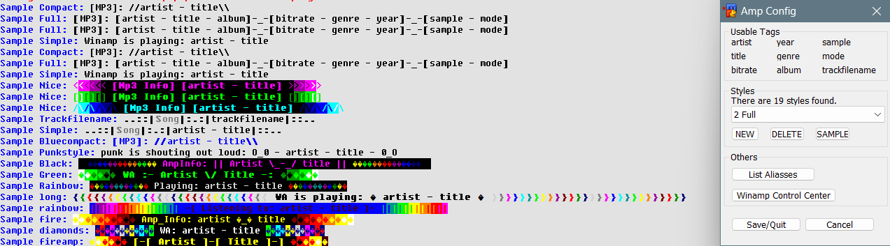

# context
- Display your winamp stats on IRC  
- Works with wa_link.dll & swamp.dll 
- Usage from popup screen or via alias

# how to
- load the mrc file
- put the .dll files in the `%appdata%\mirc` folder
- put the ampstyles.jay file in the `%appdata%\mirc` folder
 
# screenshot

# version
1.4 - 2008-01-15

# author
Jorrit Vander Mynsbrugge
