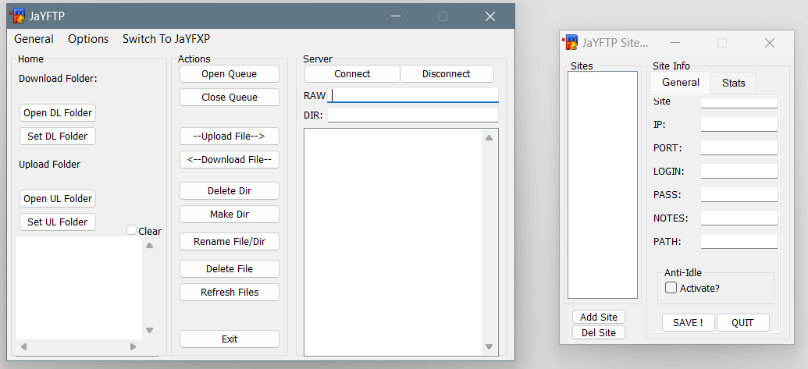

# context
- FTP client written in msl using sockets

- List Of Working Features:
  - Uploading, Downloading, One file at a time.
  - Entering Raw commands as wel as quick dir locations.
  - All buttons in the main action screen also work.(in exeption for 'delete dir')
  - Full use of sites manager.

# screenshot

